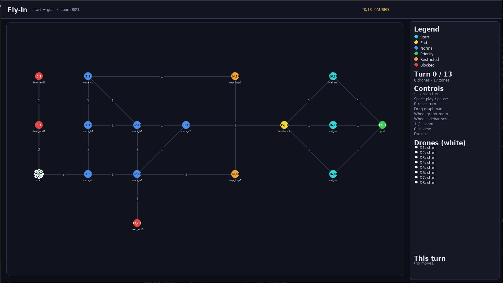

*This project has been created as part of the 42 curriculum by mafonso.*

# Fly-In

## Description
Fly-In is an algorithmic optimization project focused on multi-agent pathfinding and scheduling. The goal is to route a fleet of drones from a starting hub to an ending hub across a network of interconnected zones, while strictly respecting node capacities, connection limits, and travel times. This project implements a turn-based simulation that calculates the minimum number of turns required to safely transport all drones without collisions or bottleneck deadlocks.

## Instructions
The program is built using Python 3.10+ and uses only standard libraries for core solving. Pygame is used for the graphical visualization.

```bash
# Install dependencies and prepare a virtual environment
make install

# Run the simulation (stdout = mandatory move lines, stderr = summary)
python3 app.py maps/easy/01_linear_path.txt

# Run with only the mandatory output lines
python3 app.py maps/easy/01_linear_path.txt --no-summary 2>/dev/null

# Run the pygame visualization (resizable window, zoom/pan)
python3 app.py maps/easy/01_linear_path.txt --visualize
```

For a full step-by-step guide to building this project from scratch, see [TUTORIAL.md](TUTORIAL.md).

## Visual Overview
The `--visualize` flag opens an interactive Pygame window showing the zone graph, live drone positions, and per-turn move summaries in a sidebar. Drones are rendered as white circles labeled with their ID; zones are color-coded by type (normal, priority, restricted, blocked), with active connections highlighted in blue. Users can pan by dragging, zoom with the mouse wheel or +/- keys, and step through turns manually or via autoplay (Space).



## Algorithm Choices
The routing engine employs **Prioritized A* Pathfinding with a Time-Expanded Reservation Table**:
1. **Time-Space Expansion**: Instead of searching merely across spatial nodes, the search space is expanded to `(Node, Time)` pairs. This naturally avoids temporal collisions between drones.
2. **Prioritized Planning**: Drones are processed sequentially (D1, then D2, etc.). When a drone finds a path, it reserves the necessary capacity on nodes and connections at the specific times it will occupy them. Subsequent drones treat these reservations as constraints.
3. **Capacity Tracking**: A global reservation table tracks both `zone_occupancy` (drones resting or arriving in a zone) and `conn_occupancy` (drones traversing a link). This allows multiple drones to share paths up to their maximum configured capacity.
4. **Heuristic Pre-computation**: A backward BFS from the `end_hub` generates an exact distance heuristic (ignoring capacities), drastically speeding up the A* search for each individual drone.

## Technical Choices
* **Dataclasses**: Used extensively for `Zone`, `Connection`, `Drone`, and `MapData` (in `model.py`) to provide strict typing and clean model separation.
* **Separation of Concerns**: The project is split into distinct modules: `parser.py` (handles input validation and regex parsing), `model.py` (data structures), `pathfinder.py` (the core A* algorithm), `app.py` (execution and output formatting), and the visualization layer split between `view_terminal.py`, `view_pygame.py`, and shared helpers in `visual_common.py`.
* **Restricted Zone Handling**: Transitions to `restricted` zones cost 2 turns. The pathfinder correctly models this by reserving the connection capacity for *both* transit turns, while only moving the drone into the destination zone's capacity on the final turn.

## Performance
The prioritized A* algorithm guarantees that valid paths are found rapidly, avoiding the combinatorial explosion of searching the joint state space of all drones simultaneously. It easily meets the benchmark requirements for Easy and Medium maps.

## Resources
* [Multi-Agent Pathfinding (MAPF)](https://en.wikipedia.org/wiki/Multi-agent_pathfinding)
* [Cooperative Pathfinding / Prioritized Planning](https://www.davidsilver.uk/wp-content/uploads/2020/03/coop-path-AIIDE.pdf)
* [Introduction to Graph Theory (DataCamp)](https://www.datacamp.com/tutorial/introduction-to-graph-theory)
* AI was utilized to assist in writing the map parsing regular expressions, scaffolding the `A*` time-expansion loop, in visual design in terminal and graphical mode and generating this README documentation.